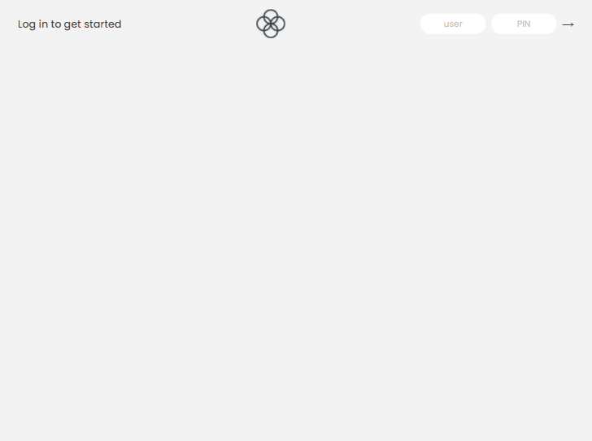

# 💰 Bankist

    

Mini bank application

 
	🚧  Finished ! 🚧

## 💻 Overview

This is a mini bank application developed in Jonas Schmedtmann's Javascript course that puts into practice mainly the study of arrays in Javascript.

### 🔎 How to test

You can test the project at the link below. For this it is necessary to use the correct login and password sets which are:

- Account 1: js / 1111
- Account 2: jd / 2222

I improved the layout to be responsive and I also put some error messages to help understanding.
Obs: To request a loan, there must be at least one deposit equal to or greater than 10% of the requested amount.

[Click here to test !]()

### 🎨 Interface

